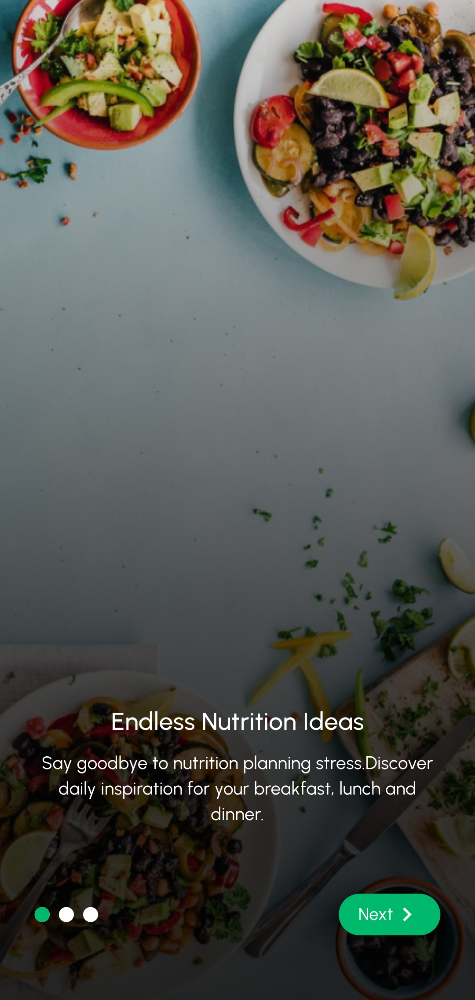
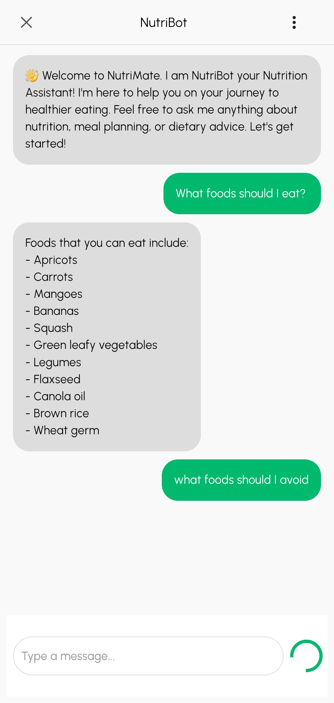
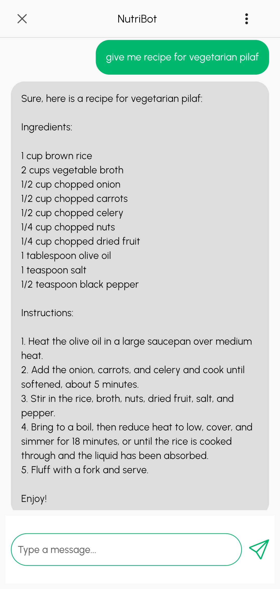
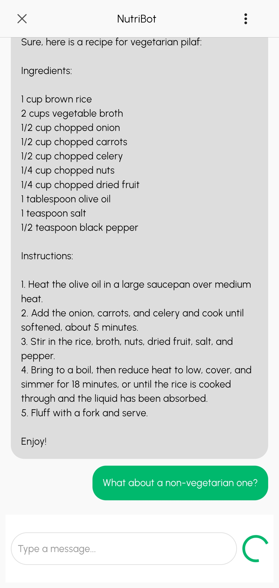
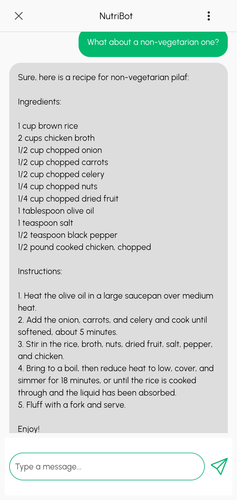

# NutriMate 🥗

An intelligent nutrition chat system that leverages Retrieval Augmented Generation (RAG) to deliver personalized dietary guidance. NutriMate combines a comprehensive nutrition knowledge base with advanced natural language processing to provide tailored recommendations based on users' health profiles, dietary preferences, and wellness goals.

> **Note**: This repository contains the Flutter mobile application. The backend API is available in a separate repository: [NutriMate Backend](https://github.com/samrasugu/nutrimate_backend)

## 🌟 Features

- **Personalized Nutrition Guidance**: Get customized dietary recommendations based on your health profile
- **Intelligent Chat Interface**: Natural language conversations about nutrition and wellness
- **RAG-Powered Responses**: Combines real-time information retrieval with AI generation for accurate advice
- **Health Profile Management**: Track your dietary preferences, allergies, and wellness goals
- **Comprehensive Knowledge Base**: Access to extensive nutrition and health information
- **Real-time Recommendations**: Get instant responses to your nutrition queries

## 🛠️ Tech Stack

### Frontend
- **Flutter**: Cross-platform mobile application framework
- **Async Redux**: State management

### Backend
- **Python**: Core backend language
- **Flask**: Web framework for API development
- **LangChain**: Framework for building LLM-powered applications
- **OpenAI**: Large language model for natural language processing

### Database & Storage
- **PostgreSQL**: Primary database for user data and application state
- **Pinecone**: Vector database for storing and retrieving embeddings
- **Redis**: Caching layer for improved performance

## 🚀 Getting Started

### Prerequisites

- Flutter SDK (3.0 or higher)
- Python 3.8+
- PostgreSQL
- Redis
- OpenAI API key
- Pinecone API key

### Installation

1. **Clone the repository**
   ```bash
   git clone https://github.com/samrasugu/nutrimate.git
   cd nutrimate
   ```

2. **Set up Flutter dependencies**
   ```bash
   flutter pub get
   ```

3. **Set up Python backend**
   ```bash
   # Clone the backend repository
   git clone https://github.com/samrasugu/nutrimate_backend.git
   cd nutrimate_backend
   
   # Install dependencies
   pip install -r requirements.txt
   ```

4. **Configure environment variables**
   ```bash
   # Create .env file with your API keys
   OPENAI_API_KEY=your_openai_api_key
   PINECONE_API_KEY=your_pinecone_api_key
   PINECONE_ENVIRONMENT=your_pinecone_environment
   DATABASE_URL=your_postgresql_url
   REDIS_URL=your_redis_url
   ```

5. **Run the application**
   ```bash
   # Start backend services (in backend directory)
   cd nutrimate_backend
   python app.py
   
   # Start Flutter app (in main directory)
   cd ../nutrimate
   flutter run
   ```

## 🏗️ Architecture

NutriMate follows Domain Driven Design (DDD), a clean architecture pattern, with the following layers:

- **Presentation Layer**: Flutter UI components and state management
- **Application Layer**: Business logic and use cases
- **Domain Layer**: Core entities and interfaces
- **Infrastructure Layer**: Data sources, APIs, and external services

## 📱 Screenshots

<div align="center">
  
  
  
  
  
</div>

<p align="center">
  <em>NutriMate app screenshots showcasing the user interface and features</em>
</p>

## 🤝 Contributing

Contributions are welcome! Please feel free to submit a Pull Request.

## 📄 License

This project is licensed under the MIT License - see the [LICENSE](LICENSE) file for details.

## 🙏 Acknowledgments

- OpenAI for providing the language model capabilities
- LangChain for the RAG framework
- Pinecone for vector database services
- The Flutter team for the excellent cross-platform framework
